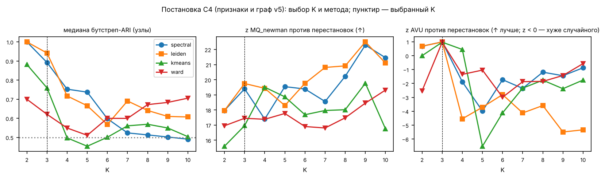
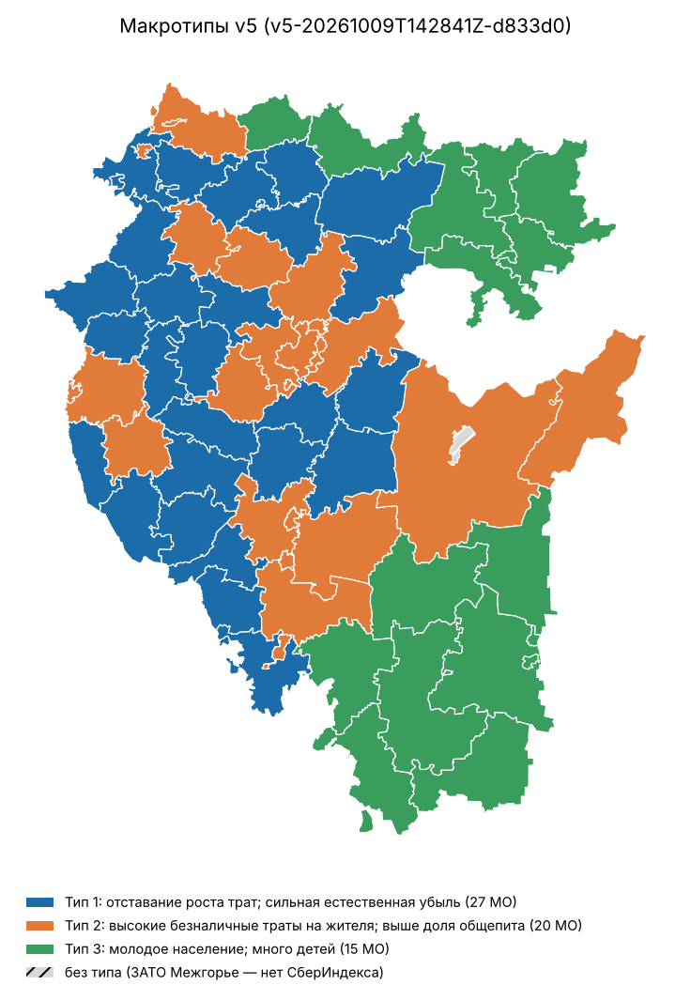
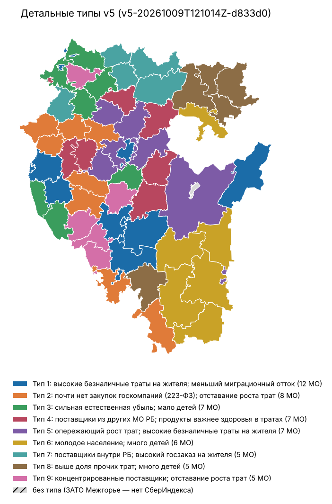
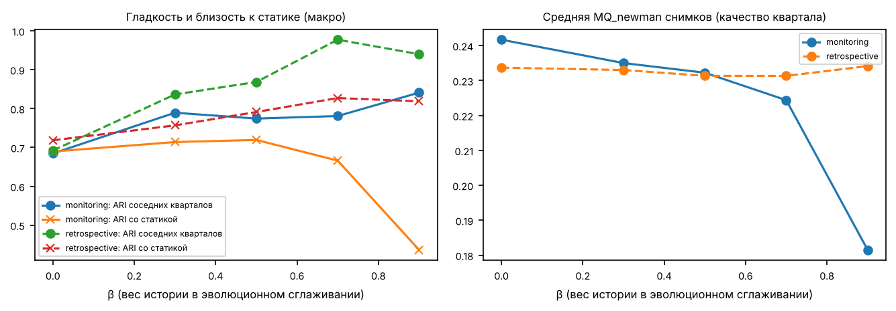

# Экономическая структура муниципалитетов Республики Башкортостан: кластеризация атрибутированных сетей (econtypes v5)

Конкурс СберИндекса, задача 1. Региональный кейс: 63 муниципальных образования Республики Башкортостан; основная типология — 62 МО (ЗАТО Межгорье без данных СберИндекса рассмотрено отдельно). Результат не является общероссийским. Прогон `v5-20261009T142841Z-d833d0` (seed 20261009, config `d833d01329f4019a`, code `eb402d7943388054`, data `24f5b250a5cc5492`). Все числа ниже взяты из файлов этого прогона скриптом `scripts/make_report.py`.

## 1. Главное

* **Макроуровень — 3 типа** (spectral, постановка C4_v5features_v5graph). K не задавался: выбран правилом «Pareto по z-оценкам ICVI → минимальный размер ≥ 3 → медиана бутстреп-ARI ≥ 0,5 → средний ранг z». Устойчивость: медиана ARI 0,89 при подвыборке узлов, 0,82 при блочном бутстрепе месяцев, 0,91 при пересборке признаков и сети.
* **Детальный уровень — 5 типов** (spectral, то же правило при K ≥ 5): медиана бутстреп-ARI 0,74 — устойчив лишь частично; используется как уточнение, а не как самостоятельный вывод.
* **Типология v4 (K = 7) не воспроизводится**: ARI между v5 и v4 = 0,29. После исправления AVU та же постановка v4 (признаки и граф v4) выбирает K = 6, а не 7. Численные выводы v4 в v5 не переносятся.
* **Опубликованный AVU** на расчётной сети v4 с метками v4 = 0,5357 (в v4 под именем AVU максимизировалась доля внутренних связей). AVU не лучше перестановочного нуля у 136 из 144 разбиений сетки (p ≥ 0,05), а у 118 — хуже случайного (z < 0), тогда как модулярность значимо выше нуля (медиана z MQ_newman 19,2): внутри типов связи плотнее, но межтиповые связи сосредоточены между соседними типами — экономическое пространство региона скорее непрерывно, чем распадается на изолированные блоки.
* **Внешняя проверка** признаками, не входившими в обучение (ВПН-2020: источники средств к существованию, образование; МСП): 24 из 29 показателей значимо различаются между типами после BH; 22 — и против пространственного нуля (MSR).
* **Корреляции**: 1060 тестов; 311 проходят BY (q < 0,05), 269 помечены «устойчивыми» (BY + пространственный нуль + знак без Уфы + частная по log населения).
* **Динамика** (2023Q1–2024Q4, режим мониторинга без информации из будущего): тест утечки — PASS.

## 2. Данные и источники

Новая база `data/econtypes_v5.sqlite` (слои L0 сырьё → L1 нормализация → L2 атрибуты МО × период → L3 результаты прогонов), миграции, идемпотентный ingest, экспорт Parquet. Исходные файлы и папки не изменялись. Реестр источников — `docs/SOURCE_REGISTRY.csv`, пробелы — `docs/DATA_GAPS.md`.

* Госзаказ 44-ФЗ и 223-ФЗ: 359 615 записей (8 canonical CSV); независимый пересчёт DuckDB совпал с базой до копейки (1 263 174 213 398,89 руб. с известной суммой в рублях). Признаки госзаказа строятся по 44-ФЗ; 223-ФЗ — отдельный показатель на жителя.
* Привязка заказчиков к МО: явное МО в названии (2 038 организаций) и код налогового органа КПП; точность кода КПП по исключению по одному — 99,2% на 2 034 организациях. Первые цифры ИНН — только анализ чувствительности.
* Реестр МСП (снимок 10.09.2026): 150 234 субъектов; используется только как внешний показатель специализации (сглаженный LQ).
* СберИндекс: помесячные безналичные траты на жителя и их структура по 6 категориям 2023–2024 — архивные производные v4 (сырых parquet нет).
* Росстат (с Google Drive пользователя, SHA-256 в `external/rosstat_drive/DRIVE_DOWNLOADS.jsonl`): численность на 1 января 2022–2025, естественное движение 2023–2024, коэффициенты миграции 2018–2024, ВПН-2020 (возраст, образование, источники средств).
* Контроль баланса населения ΔN = рождения − смерти + миграция: максимальный остаток 0,056% населения.

## 3. Методология

**Узлы** — МО. **Атрибуты** (18 после преобразований, без импутации): уровень и относительный тренд трат СберИндекса; структура трат в ILR-координатах (Aitchison); госзаказ 44-ФЗ и 223-ФЗ на жителя; доля муниципальных заказчиков; HHI поставщиков; география поставщиков (ILR: своё МО / другие МО РБ / вне РБ); рост населения, естественный и миграционный прирост; возрастная структура (ILR). Стандартизация — робастные z (медиана/IQR), вес блока λ_b = 1/p_b.

**Рёбра**: self-tuning kNN (k = 8, локальный масштаб — 7-й сосед) по блочному расстоянию атрибутов, объединённый с нормированными структурными слоями (совместное движение трат, опережение-запаздывание, DTW — только по месяцам окна; потоки закупок между МО), α = 0,5. Расчётная матрица W хранится отдельно от визуальной проекции: 1 079 рёбер против 164 в проекции union-kNN k = 4; сетевые ICVI считаются только по W.

**Кластеризация и выбор**: spectral (cluster_qr) и Leiden (RB-модулярность с подбором разрешения под K), контроль — k-means и Ward; K = 2…10. Для каждого разбиения: SW, CH, DB, S_Dbw (явные соглашения о неопределённых слагаемых), опубликованные AVI/AVU, MQ_newman (γ = 1) и MQ_mancoridis; z-оценки против перестановочного нуля, p = (b+1)/(B+1). Правило выбора зафиксировано в коде (`experiments.select`) до просмотра типов.

**Динамика**: квартальные снимки с эволюционным сглаживанием (W_t ← (1−β)W_t + βW_{t−1}, β ∈ {0; 0,3; 0,5; 0,7; 0,9}), венгерское выравнивание меток, таблицы переходов, Жаккар, события split/merge/birth/death. Два режима: **мониторинг** (только данные, опубликованные к концу квартала, с лагами) и **реконструкция** (ретроспективно, со структурой трат за весь период).

**Неопределённость**: co-assignment по трём схемам (подвыборка узлов, блочный бутстреп месяцев, пересборка признаков и сети). **Корреляции**: Pearson и Spearman с перестановочными p (B = 9 999), BH/BY, e-BH, пространственный нуль Moran spectral randomization по смежности полигонов, частные по log населения, разложение панели на межмуниципальную и внутримуниципальную части.

*Рис. 1. Выбор K и метода в постановке C4.*

*Таблица 1. Выбранные разбиения по постановкам (C1 — признаки и граф v4; C4 — признаки и граф v5).*

| постановка | метод | K | бутстреп-ARI | ранг z | SW | CH | S_Dbw | AVI | AVU ↓ | MQ_newman |
|---|---|---|---|---|---|---|---|---|---|---|
| C1_v4features_v4graph | spectral | 6 | 0,57 | 3,67 | 0,07 | 6,3 | 0,78 | 0,40 | 0,55 | 0,24 |
| C2_v5features_v4graph | leiden | 3 | 0,76 | 6,17 | 0,16 | 13,5 | 0,76 | 0,67 | 0,67 | 0,33 |
| C3_v4features_v5graph | spectral | 10 | 0,55 | 4,00 | 0,01 | 4,2 | 0,66 | 0,25 | 0,51 | 0,16 |
| C4_v5features_v5graph | spectral | 3 | 0,89 | 7,17 | 0,15 | 12,7 | 0,77 | 0,61 | 0,67 | 0,28 |
| C4_v5features_v5graph [детальный уровень K≥5] | spectral | 5 | 0,75 | 5,50 | 0,06 | 8,8 | 0,66 | 0,43 | 0,57 | 0,24 |

## 4. Типы муниципалитетов (макроуровень)

*Рис. 2. Макротипы v5 на карте Республики Башкортостан.*

### Тип 1: отставание роста трат; сильная естественная убыль

27 МО, население на 1.01.2024 — 649 351 чел. Отличительные признаки (разность медиан робастных z с остальными МО): отставание роста трат; сильная естественная убыль; низкие безналичные траты на жителя [sber_rel_trend (-1.38 IQR-z); natinc_rate (-1.36); sber_spend_pc_log (-1.26)].

* Медианы: безналичные траты 19 509 руб./жителя/мес.; госзаказ 44-ФЗ 13 371 руб./жителя/год; изменение населения за 2023 г. -1,9%; естественный прирост -9,9‰; миграционный -8,0‰ (в таблицах Росстата — на 10 000 жителей: -79,8); доля 65+ 17,3%.
* Внешние показатели (не входили в обучение): доля населения с заработком как основным источником средств 37,0%, с пенсией/пособием — 33,7%, с высшим образованием 11,9%; наибольшая специализация МСП — сельское хозяйство (LQ 2,97) (LQ сельского хозяйства 2,97, промышленности 0,99, деловых услуг 0,64).
* Медиана устойчивости членства (подвыборка узлов) 0,96; типичные МО: МР Буздякский, МР Ермекеевский, МР Федоровский; пограничных МО нет.
* Состав: ГО Агидель, МР Альшеевский, МР Архангельский, МР Аургазинский, МР Бакалинский, МР Балтачевский, МР Бижбулякский, МР Благоварский, МР Буздякский, МР Бураевский, МР Гафурийский, МР Давлекановский, МР Ермекеевский, МР Илишевский, МР Калтасинский, МР Караидельский, МР Кармаскалинский, МР Краснокамский, МР Кушнаренковский, МР Куюргазинский, МР Мишкинский, МР Миякинский, МР Нуримановский, МР Стерлибашевский, МР Федоровский, МР Чекмагушевский, МР Шаранский.

### Тип 2: высокие безналичные траты на жителя; выше доля общепита

20 МО, население на 1.01.2024 — 2 987 704 чел. Отличительные признаки (разность медиан робастных z с остальными МО): высокие безналичные траты на жителя; выше доля общепита; меньший миграционный отток [sber_spend_pc_log (+1.49 IQR-z); sber_ilr2 (-1.43); migr_rate (+1.35)].

* Медианы: безналичные траты 27 782 руб./жителя/мес.; госзаказ 44-ФЗ 16 783 руб./жителя/год; изменение населения за 2023 г. -0,9%; естественный прирост -5,5‰; миграционный -2,6‰ (в таблицах Росстата — на 10 000 жителей: -25,6); доля 65+ 15,1%.
* Внешние показатели (не входили в обучение): доля населения с заработком как основным источником средств 43,6%, с пенсией/пособием — 28,3%, с высшим образованием 15,3%; наибольшая специализация МСП — общепит, досуг, бытовые услуги (LQ 1,12) (LQ сельского хозяйства 1,02, промышленности 1,06, деловых услуг 0,83).
* Медиана устойчивости членства (подвыборка узлов) 0,95; типичные МО: МР Бирский, МР Мелеузовский, МР Стерлитамакский; пограничных МО нет.
* Состав: ГО Кумертау, ГО Нефтекамск, ГО Октябрьский, ГО Салават, ГО Стерлитамак, ГО Уфа, МР Белебеевский, МР Белорецкий, МР Бирский, МР Благовещенский, МР Дюртюлинский, МР Иглинский, МР Ишимбайский, МР Мелеузовский, МР Стерлитамакский, МР Туймазинский, МР Уфимский, МР Учалинский, МР Чишминский, МР Янаульский.

### Тип 3: молодое население; много детей

15 МО, население на 1.01.2024 — 411 830 чел. Отличительные признаки (разность медиан робастных z с остальными МО): молодое население; много детей; выше доля транспорта в тратах [age_ilr2 (+1.58 IQR-z); age_ilr1 (+1.33); sber_ilr4 (-1.32)].

* Медианы: безналичные траты 20 451 руб./жителя/мес.; госзаказ 44-ФЗ 14 443 руб./жителя/год; изменение населения за 2023 г. -1,8%; естественный прирост -5,8‰; миграционный -10,4‰ (в таблицах Росстата — на 10 000 жителей: -104,0); доля 65+ 13,7%.
* Внешние показатели (не входили в обучение): доля населения с заработком как основным источником средств 36,7%, с пенсией/пособием — 30,8%, с высшим образованием 12,6%; наибольшая специализация МСП — сельское хозяйство (LQ 3,72) (LQ сельского хозяйства 3,72, промышленности 1,05, деловых услуг 0,63).
* Медиана устойчивости членства (подвыборка узлов) 0,94; типичные МО: МР Зилаирский, МР Салаватский, МР Зианчуринский; пограничных МО нет.
* Состав: ГО Сибай, МР Абзелиловский, МР Аскинский, МР Баймакский, МР Белокатайский, МР Бурзянский, МР Дуванский, МР Зианчуринский, МР Зилаирский, МР Кигинский, МР Кугарчинский, МР Мечетлинский, МР Салаватский, МР Татышлинский, МР Хайбуллинский.

**ЗАТО Межгорье** в основную типологию не входит (нет СберИндекса и муниципальной демографии Росстата). По блокам госзаказа ближайший центроид — Тип 2: высокие безналичные траты на жителя; выше доля общепита (расстояния до центроидов типов: 3,43; 2,06; 2,92); это ориентир, а не присвоение типа.

## 5. Детальный уровень

*Рис. 3. Детальные типы (частично устойчивы).*

*Таблица 2. Детальные типы; медиана бутстреп-ARI уровня 0,74.*

| тип | МО | население | признаки | устойчивость | примеры |
|---|---|---|---|---|---|
| Тип 1: отставание роста трат; сильная естественная убыль | 20 | 447 722 | отставание роста трат; сильная естественная убыль; старшее население (65+) | 0,82 | МР Альшеевский, МР Шаранский, МР Чекмагушевский |
| Тип 2: высокие безналичные траты на жителя; меньший миграционный отток | 12 | 2 440 263 | высокие безналичные траты на жителя; меньший миграционный отток; выше доля общепита | 0,93 | МР Мелеузовский, ГО Уфа, ГО Кумертау |
| Тип 3: опережающий рост трат; высокие безналичные траты на жителя | 11 | 662 277 | опережающий рост трат; высокие безналичные траты на жителя; медленное сокращение населения | 0,69 | МР Благовещенский, МР Чишминский, МР Иглинский |
| Тип 4: молодое население; много детей | 10 | 274 565 | молодое население; много детей; выше доля транспорта в тратах | 0,82 | МР Баймакский, МР Хайбуллинский, МР Бурзянский |
| Тип 5: поставщики внутри РБ; выше доля транспорта в тратах | 9 | 224 058 | поставщики внутри РБ; выше доля транспорта в тратах; ниже доля общепита | 0,80 | МР Аскинский, МР Татышлинский, МР Балтачевский |

## 6. Сравнение постановок и абляция

*Таблица 3. Сравнение разметок: признаки старые/новые × граф старый/новый, spectral против Leiden, контрольные методы.*

| разметка | K | ARI с итогом v5 | ARI с v4 | AVU (своя W) | MQ_newman (своя W) | SW (свои X) |
|---|---|---|---|---|---|---|
| v4_published_labels(K=7) | 7 | 0,29 | 1,00 | 0,54 | 0,24 | 0,05 |
| C1_v4features_v4graph/spectral/K=6/selected | 6 | 0,31 | 0,47 | 0,55 | 0,24 | 0,07 |
| C2_v5features_v4graph/leiden/K=3/selected | 3 | 0,83 | 0,35 | 0,67 | 0,33 | 0,16 |
| C3_v4features_v5graph/spectral/K=10/selected | 10 | 0,23 | 0,36 | 0,51 | 0,16 | 0,01 |
| C4_v5features_v5graph/spectral/K=3/selected | 3 | 1,00 | 0,29 | 0,67 | 0,28 | 0,15 |
| C4_v5features_v5graph/spectral/K=5/detailed | 5 | 0,53 | 0,31 | 0,57 | 0,24 | 0,06 |
| C1_v4features_v4graph/spectral/K=3/common_K | 3 | 0,65 | 0,39 | 0,67 | 0,29 | 0,09 |
| C1_v4features_v4graph/spectral/K=7/v4_K | 7 | 0,25 | 0,66 | 0,54 | 0,24 | 0,06 |
| C1_v4features_v4graph/leiden/K=3/common_K | 3 | 0,78 | 0,37 | 0,67 | 0,29 | 0,09 |
| C1_v4features_v4graph/leiden/K=7/v4_K | 7 | 0,24 | 0,36 | 0,54 | 0,24 | 0,06 |
| C1_v4features_v4graph/kmeans/K=3/attributes_only | 3 | 0,30 | 0,23 | 0,67 | 0,21 | 0,14 |
| C1_v4features_v4graph/ward/K=3/attributes_only | 3 | 0,44 | 0,13 | 0,67 | 0,19 | 0,12 |
| C2_v5features_v4graph/spectral/K=3/common_K | 3 | 0,65 | 0,32 | 0,67 | 0,33 | 0,15 |
| C2_v5features_v4graph/spectral/K=7/v4_K | 7 | 0,35 | 0,27 | 0,55 | 0,23 | 0,05 |

Абляция (38 вариантов: исключение блока, слоя, смена α, k, правила рёбер, географии): медиана ARI с итогом 0,81, минимум 0,46 (forward_add: sber_level). Строгая география (только явное МО и согласованный налоговый орган): ARI 0,77.

*Таблица 4. Наиболее чувствительные варианты абляции.*

| вид | вариант | K | ARI с итогом |
|---|---|---|---|
| forward_add | sber_level | 3 | 0,46 |
| forward_add | sber_level+sber_structure+proc_budget+proc_geo | 3 | 0,58 |
| fusion | SNF(attr, comovement, dtw, flow) | 3 | 0,58 |
| forward_add | sber_level+sber_structure+proc_budget+proc_geo+proc_corp | 3 | 0,61 |
| forward_add | sber_level+sber_structure | 3 | 0,62 |
| forward_add | sber_level+sber_structure+proc_budget | 3 | 0,66 |
| edge_rule | cosine_union_kNN (v4) | 3 | 0,69 |
| drop_block | −age_structure | 3 | 0,71 |

## 7. Динамика 2023–2024

*Рис. 4. Чувствительность динамики к β.*

При β = 0,5 в режиме мониторинга средний ARI соседних кварталов 0,77, ARI со статической типологией 0,72. Большие β дают гладкость ценой отрыва от текущих данных (снижение MQ снимков) — поэтому основной β = 0,5, остальные приводятся как чувствительность.

События (мониторинг, β = 0,5): continuation — 17, split — 3, merge — 3. Первые кварталы 2023 г. — период разогрева (окно короче года), их перестройки не интерпретируются как экономические сдвиги.

Тест утечки: данные после 2023Q4 искажены, расчёт до 2023Q4 повторён. Мониторинг — признаки, W и метки идентичны; реконструкция — признаки и W меняются (статус PASS). Метки по кварталам — `LABELS_MO_PERIOD*.csv`.

## 8. Внешняя проверка и корреляции

*Таблица 5. Различия внешних показателей между макротипами (не использовались в обучении).*

| показатель | ε² (Крускал–Уоллис) | p перест. | q BH | p простр. (MSR) | I Морана |
|---|---|---|---|---|---|
| LQ МСП: сельское хозяйство | 0,57 | 0,0005 | 0,0007 | 0,002 | 0,20 |
| дотации на выравнивание на жителя (архив v4) | 0,55 | 0,0005 | 0,0007 | 0,002 | 0,15 |
| ВПН-2020: заработок — основной источник средств | 0,55 | 0,0005 | 0,0007 | 0,002 | 0,23 |
| доля городского населения (архив v4) | 0,53 | 0,0005 | 0,0007 | 0,002 | 0,07 |
| плотность населения, log (архив v4) | 0,50 | 0,0005 | 0,0007 | 0,002 | 0,14 |
| ВПН-2020: личное подсобное хозяйство — основной источник | 0,50 | 0,0005 | 0,0007 | 0,002 | 0,09 |
| ВПН-2020: пенсия/пособие — основной источник | 0,49 | 0,0005 | 0,0007 | 0,002 | 0,21 |
| доля занятых в бюджетном секторе (архив v4) | 0,47 | 0,0005 | 0,0007 | 0,002 | 0,21 |
| LQ МСП: ИТ, финансы, недвижимость, деловые услуги | 0,43 | 0,0005 | 0,0007 | 0,002 | 0,12 |
| ВПН-2020: доля с высшим образованием | 0,42 | 0,0005 | 0,0007 | 0,002 | 0,17 |

*Таблица 6. Наиболее сильные устойчивые связи признаков с внешними показателями (Pearson); исключены 4 механически связанных пар (ILR возраста × коэффициенты нагрузки — из одной таблицы возраста ВПН-2020).*

| признак | внешний показатель | r | 95% ДИ | q BY | p простр. | r частн. (log нас.) | r без Уфы |
|---|---|---|---|---|---|---|---|
| траты СберИндекса на жителя (log) | ВПН-2020: заработок — основной источник средств | 0,83 | [0,75; 0,89] | 0,0042 | 0,001 | 0,44 | 0,82 |
| траты СберИндекса на жителя (log) | дотации на выравнивание на жителя (архив v4) | -0,79 | [-0,88; -0,68] | 0,0042 | 0,001 | -0,23 | -0,77 |
| ILR2 трат: …vs общепит | ВПН-2020: пенсия/пособие — основной источник | 0,79 | [0,69; 0,87] | 0,0042 | 0,001 | 0,50 | 0,77 |
| изменение населения | субъекты МСП на 1 000 жителей (2026) | 0,78 | [0,61; 0,88] | 0,0042 | 0,001 | 0,63 | 0,77 |
| ILR2 трат: …vs общепит | дотации на выравнивание на жителя (архив v4) | 0,77 | [0,66; 0,85] | 0,0042 | 0,001 | 0,28 | 0,75 |
| миграционный прирост, на 10 000 | субъекты МСП на 1 000 жителей (2026) | 0,77 | [0,57; 0,87] | 0,0042 | 0,001 | 0,62 | 0,76 |
| траты СберИндекса на жителя (log) | LQ МСП: сельское хозяйство | -0,77 | [-0,85; -0,65] | 0,0042 | 0,001 | -0,42 | -0,75 |
| естественный прирост, ‰ | нагрузка старшими (65+ на 100 в 20–64) | -0,76 | [-0,85; -0,63] | 0,0042 | 0,001 | -0,76 | -0,76 |
| траты СберИндекса на жителя (log) | ВПН-2020: пенсия/пособие — основной источник | -0,75 | [-0,85; -0,60] | 0,0042 | 0,001 | -0,34 | -0,72 |
| траты СберИндекса на жителя (log) | доля городского населения (архив v4) | 0,75 | [0,56; 0,89] | 0,0042 | 0,001 | 0,38 | 0,73 |

Связи описательные, не причинные. Уровень безналичных трат на жителя: ВПН-2020: заработок — основной источник средств — r = 0,83 (частная по log численности 0,44); дотации на выравнивание на жителя (архив v4) — r = -0,79 (частная по log численности -0,23); LQ МСП: сельское хозяйство — r = -0,77 (частная по log численности -0,42). Где частная корреляция заметно слабее полной, часть связи объясняется масштабом МО.

*Таблица 7. Разложение панельных корреляций (кварталы 2023–2024): межмуниципальная и внутримуниципальная части.*

| признак 1 | признак 2 | между МО | внутри МО | 95% ДИ (кластерный бутстреп) |
|---|---|---|---|---|
| госзаказ 44-ФЗ на жителя (log) | HHI поставщиков | 0,43 | 0,72 | [0,58; 0,81] |
| госзаказ 44-ФЗ на жителя (log) | ILR1 поставщиков: своё МО vs другие МО РБ | 0,03 | -0,51 | [-0,68; -0,30] |
| HHI поставщиков | ILR1 поставщиков: своё МО vs другие МО РБ | -0,23 | -0,46 | [-0,67; -0,19] |
| траты СберИндекса на жителя (log) | госзаказ 44-ФЗ на жителя (log) | 0,13 | -0,24 | [-0,38; -0,10] |
| траты СберИндекса на жителя (log) | ILR1 поставщиков: своё МО vs другие МО РБ | 0,48 | 0,23 | [0,08; 0,38] |
| траты СберИндекса на жителя (log) | закупки 223-ФЗ на жителя (log) | 0,49 | -0,17 | [-0,34; 0,01] |

Корреляции между МО и во времени внутри МО могут иметь разный знак; выводы о динамике делаются только по внутренней части.

## 9. Проверка вне периода обучения

*Таблица 8. Узнаётся ли тип 2023–2024 по блокам госзаказа 44-ФЗ 2025 и 2026 (YTD): ближайший центроид; первая строка уровня — та же процедура на обучающем периоде (потолок); нуль — перестановка предсказанных меток.*

| уровень | год | МО | точность | нуль (среднее) | нуль q95 | p |
|---|---|---|---|---|---|---|
| macro | 2023–2024 (в выборке) | 62 | 0,61 | 0,34 | 0,44 | 0,0001 |
| macro | 2025 | 62 | 0,65 | 0,39 | 0,48 | 0,0001 |
| macro | 2026 | 62 | 0,68 | 0,39 | 0,47 | 0,0001 |
| detailed | 2023–2024 (в выборке) | 62 | 0,65 | 0,20 | 0,29 | 0,0001 |
| detailed | 2025 | 62 | 0,40 | 0,19 | 0,27 | 0,0001 |
| detailed | 2026 | 62 | 0,40 | 0,21 | 0,29 | 0,0001 |

Это проверка воспроизводимости разметки по одному блоку, а не независимое подтверждение экономической истинности типов. Блок 223-ФЗ исключён: в 2025 г. в выгрузке лишь 1 340 записей 223-ФЗ против 35 631 в 2023 г. (разрыв покрытия источника, `docs/DATA_GAPS.md`, п. 25). Общий сдвиг уровня закупок (инфляция) стандартизацией 2023–2024 не устраняется.

## 10. Исправления относительно v4

Полная таблица — `CHANGELOG.md`. Кратко: опубликованный AVU вместо максимизировавшейся доли внутренних связей; оба определения MQ с γ; S_Dbw с явными соглашениями (в v4 все слагаемые плотности были нулевыми — S_Dbw совпадал со Scat); слои без информации из будущего; точная W отдельно от проекции; p = (b+1)/(B+1); краевые случаи DTW/log 0/kNN; география без ИНН→ОКТМО; имена типов по профилям; вводящие в заблуждение прокси сняты.

*Таблица 9. Повтор проверок аудитора на v5.*

| проверка аудитора | статус |
|---|---|
| baseline_dimensions_and_finite_v5 | PASS |
| v4_matrix_reproduces_auditor_AVU_MQ_SDbw | PASS |
| v4_labels_rescored_on_v5_C1_matrix_independent | PASS |
| AVU_formula_and_optimization_direction | PASS |
| AVU_disconnected_three_cliques | PASS |
| finite_permutation_pvalues_are_positive | PASS |
| DTW_all_constant_series | PASS |
| zero_monthly_expenditure | PASS |
| kNN_k_above_N | PASS |
| historical_layers_do_not_use_future_EXECUTED | PASS |
| actual_self_tuning_kNN_N_2016 | PASS |
| label_permutation_invariance | PASS |
| ICVI_K_equals_N_rejected_with_status | PASS |

## 11. Ограничения

* Региональный кейс (62 + 1 МО); перенос на всю Россию не проверялся на реальных данных — только масштабирование алгоритмов на синтетике (N = 2 016: пик памяти 420.1 МиБ).
* СберИндекс — архивные производные v4, а не сырые parquet; структура трат известна только агрегатом 2023–2024 (режим реконструкции).
* Привязка организаций к МО — по названию и налоговому органу (оценённая точность), а не по ОКТМО; поставщики вне МСП-реестра и с адресом вне РБ — категория «вне РБ».
* Снимок МСП 2026 г. — не исторический; используется только как внешний показатель.
* Детальный уровень устойчив лишь частично; выводы по отдельным детальным типам — гипотезы.
* AVU при малом K дискретен (при K = 2 принимает значения 0 или 1) — сравнивается через z против перестановок, не по уровню.
* Межгорье (ЗАТО) без СберИндекса и муниципальной демографии — вне основной типологии.

## 12. Воспроизведение

Одна команда из каталога `econtypes_v5`: `bash scripts/run_all.sh` (база → тесты → расчёт → аудит → нагрузка → матрицы → D5 и дашборд → отчёт). Полный расчёт ≈ 17 мин на 4 vCPU, пик памяти 752 МиБ. Матрицы соответствия: `docs/REQUIREMENTS_MATRIX.csv`, `docs/FORMULA_IMPLEMENTATION_MATRIX.csv`; стресс-проверки: `docs/STRESS_TEST_REPORT.md`.
