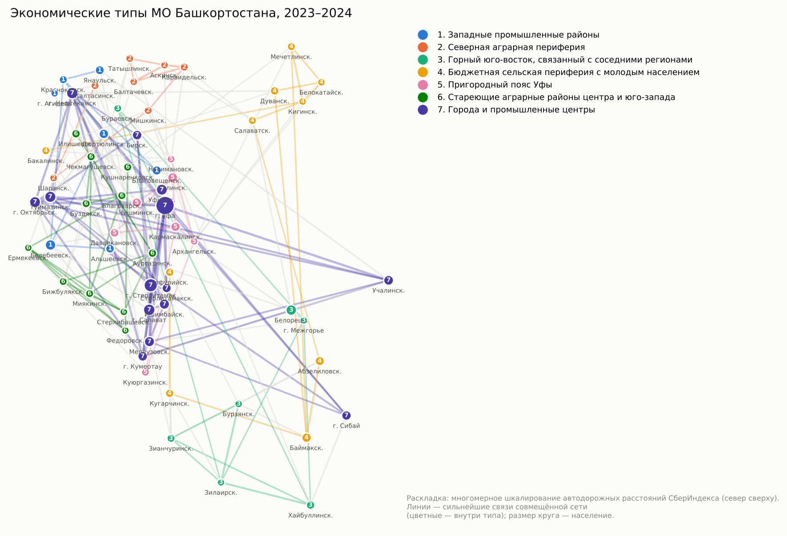

Методологический отчёт. Конкурс СберИндекса, номинация «Кластеризация». Данные 2023–2024 гг., проверка на 2025–2026 гг.

**Материалы:** сайт проекта — https://elena30r.github.io/econtypes/ · интерактивный дашборд — https://elena30r.github.io/econtypes/dashboard.html · код — https://github.com/Elena30R/econtypes · приложение с карточками 63 МО — https://elena30r.github.io/econtypes/appendix.pdf

# 1. Итог: что следует из данных

Экономика республики устроена как ядро и периферия. Ядро — 21 городов и промышленных районов (центры: г. Уфа, г. Нефтекамск, Уфимский, г. Стерлитамак, Иглинский). Остальные 42 МО — аграрная и бюджетная периферия, где зарплаты и траты жителей в 1,3–1,5 раза ниже: 29 094 ₽ против 18 883 ₽ в месяц на человека.

Различие определяется не размером района, а тем, есть ли в нём рыночная занятость. Чем больше людей работает в бюджетном секторе, тем ниже зарплаты и активность — и это верно даже для районов одного размера. Высокая бюджетная зависимость при низкой активности — в 16 МО.

Деньги периферии утекают. Бюджетные — через госзаказ: 77–87% стоимости контрактов получают поставщики не из своего района, в основном из Уфы. Потребительские — через маркетплейсы: в 16 МО на них тратят в 4–7 раз больше, чем на местный общепит. За деньгами уходят люди: в типе «Горный юго-восток, связанный с соседними регионами» миграционный отток 17,0‰ в год.

Отсюда главный вывод для политики: районам нужно удерживать деньги у себя — отдавать часть госзаказа местным поставщикам, развивать местную торговлю и услуги, кооперироваться вокруг опорных центров снабжения и создавать небюджетные рабочие места. Ниже — какие именно районы и с какими цифрами.



# 2. Главное по региону

**1. 63 муниципалитетов — 7 типов экономики.** Типы найдены по данным о тратах, госзаказе, занятости и связях между МО. Местоположение в модель не входило, но типы получились цельными территориями: 214 км между МО одного типа против 277 км у случайного разбиения. Экономическая структура привязана к месту.

**2. Разрыв между ядром и периферией.** Житель типа «Города и промышленные центры» тратит по картам 29 094 ₽ в месяц, типа «Стареющие аграрные районы центра и юго-запада» — 18 883 ₽ (в 1,5 раза меньше). Зарплаты: 58 129 ₽ против 43 478 ₽.

**3. Главная ось — бюджетная или рыночная экономика, а не размер.** Связи, которые сохраняются даже при сравнении МО одного размера и урбанизации: средняя зарплата (крупные и средние орг.) и занятые в бюджетном секторе (ρ = -0,82); занятые в бюджетном секторе и экономическая активность (ρ = -0,80); занятые в промышленности и стройке и занятые в бюджетном секторе (ρ = -0,70). Там, где больше бюджетной занятости, ниже зарплаты и активность — при любом размере района.

**4. Госзаказ уходит из районов.** Местным поставщикам достаётся 13–23% стоимости контрактов (медианы типов); меньше всего — в типе «Пригородный пояс Уфы». Остальное получают поставщики из Уфы и других регионов.

**5. Центры снабжения региона.** Больше всего соседей снабжают поставщики из: г. Уфа, г. Нефтекамск, Уфимский, г. Стерлитамак, Иглинский. Это естественные площадки для межмуниципальной логистики и совместных закупок.

**6. Население уходит из периферии.** Миграционный баланс (медиана типа): от -17,0‰ в типе «Горный юго-восток, связанный с соседними регионами» до -1,6‰ в типе «Города и промышленные центры».

**7. В сёлах деньги уходят на маркетплейсы.** На маркетплейсы тратят в 1,9–4,5 раза больше, чем на общепит (медианы типов). Местная сфера услуг не удерживает расходы жителей.

**8. Типы устойчивы и проверены на новых данных.** Бутстреп: ARI 0,61; по закупкам 2025 г. тип узнаётся в 30% случаев, 2026 г. тип узнаётся в 35% случаев при случайных 15%.

# 3. Методология


Документ для защиты проекта. Описывает весь путь от исходных файлов до рекомендаций по каждому МО
и показывает, где именно в нём машинное обучение. Числа приведены для Республики Башкортостан
(63 МО, 2023–2024 гг.); при пересчёте на новых данных они обновляются в `outputs/conclusions.md` и в дашборде.

## 3.1 Схема

```
исходные файлы ─► econtypes ingest ─► база данных (raw_*)
                                          │
        ┌─────────────────────────────────┘
        ▼
  признаки МО (32) ──► сеть МО (5 слоёв + атрибуты) ──► кластеризация (7 методов) ──► ICVI, выбор k
        │                       │                             │
        │                       │                             ├─► динамика по кварталам
        │                       │                             ├─► бутстреп, география, проверка 2025–2026
        ▼                       ▼                             ▼
  индексы МО (13) ◄──── сетевые центральности        случайный лес: объяснение типов, аналоги
        │
        ├─► корреляции (Спирмен + FDR, частные, лаги)
        └─► правила рекомендаций ─► карточки МО, выводы, дашборд   (всё пишется в базу: res_*)
```

Каждый шаг — отдельная команда (`econtypes run`, `metrics`, …), читающая и пишущая таблицы базы.
Поэтому любой шаг можно перезапустить отдельно, а внешние системы (BI, Excel, Python) могут брать
результаты прямо из базы.

## 3.2 Данные и их привязка к МО

* **Контракты ЕИС.** МО заказчика и поставщика определяется по первым четырём цифрам ИНН (код налоговой
  инспекции). Таблица «код → МО» строится автоматически по самим данным: для каждого кода берётся МО,
  которое чаще всего встречается в названиях заказчиков с этим кодом. Республиканские органы, зарегистрированные
  в Уфе, исключаются из признаков Уфы: они закупают для всей республики.
* **СберИндекс.** Идентификаторы территорий сопоставлены с названиями по совпадению значений рядов;
  одноимённые МО разведены по расстоянию до Уфы.
* **Статистика.** Демография, дотации, занятость и зарплаты (БД ПМО), площади. Пропуски заполняются
  методом k ближайших соседей, признаки масштабируются робастно (медиана и межквартильный размах) и
  обрезаются на ±4.

## 3.3 Сеть муниципалитетов

| Слой | Как считается | Что означает ребро |
|---|---|---|
| Синхронность трат | корреляция остатков приростов log-трат (после удаления общего для региона тренда) | экономики МО реагируют на одни и те же шоки |
| Опережение | максимум корреляции при сдвиге на 1–3 мес., направление от ведущего к ведомому | изменения в одном МО предшествуют изменениям в другом |
| DTW | динамическая трансформация времени с окном Сакоэ–Чибы 2 мес. | похожая форма рядов при небольших сдвигах |
| Потоки госзаказа | F_ij / √(out_i · in_j), где F_ij — рубли от заказчиков j поставщикам i | реальные хозяйственные связи |
| Сходство признаков | косинусное сходство профилей | похожая структура экономики |
| Расстояние по дорогам | только для проверки, в модель не входит | — |

Каждый слой прорежен до 8 ближайших соседей. Итоговая матрица:
**W = α·S_attr + (1 − α)·Σ w_l·S_l**, α = 0,5; веса слоёв: синхронность 0,35, опережение 0,10, DTW 0,15, потоки 0,40.

**Почему такие веса.** Веса заданы заранее по содержательным соображениям, а затем проверены на данных
(таблицы в разделе «Сравнение методов»):

* **Потоки госзаказа — 0,40.** Единственный слой, который описывает реальные денежные связи между МО, а не
  похожесть. С профилем признаков и рядами трат он почти не совпадает (ARI не выше 0,07), то есть добавляет
  новую информацию. Если его убрать, типология меняется сильнее всего (ARI с итогом 0,51).
* **Синхронность трат — 0,35.** Самая выраженная структура среди временных слоёв (MQ 0,40) и лучшее
  совпадение с итогом среди них (ARI 0,33).
* **DTW — 0,15.** Частично дублирует синхронность (ARI между ними 0,19, наибольшее среди временных слоёв),
  поэтому вес меньше.
* **Опережение — 0,10.** На 24 месяцах лаговые связи слабые (MQ 0,29, совпадение с другими слоями около нуля).
  Слой оставлен с малым весом ради направления связи «кто опережает».
* **Расстояние по дорогам — 0.** Исключено намеренно: тогда территориальная связность типов служит
  независимой проверкой (типы получились компактными, хотя география в модель не входила).
* **α = 0,5.** При этом значении максимальны все три сетевых индекса качества: MQ 0,244, AVI 0,372,
  AVU 0,802 (при α = 0; 0,25; 0,75; 1 — не выше 0,231, 0,362 и 0,791).

**Устойчивость к выбору весов.** 50 случайных наборов весов (распределение Дирихле вокруг заданных;
веса отклоняются в среднем на 0,05–0,08, например вес потоков меняется от 0,13 до 0,64): медиана ARI с итогом
0,93, в 98% случаев не ниже 0,6. Равные веса дают ARI 0,77, исключение одного слоя — 0,84–0,92, кроме
потоков госзаказа (0,51). Вывод: типология не держится на точной подгонке весов; принципиально только
наличие слоя потоков. Расчёт: `outputs/tables/layer_weight_sensitivity.csv`.

## 3.4 Где здесь машинное обучение

| Задача | Метод | Тип обучения |
|---|---|---|
| Найти типы МО | спектральная кластеризация совмещённого графа (итог), Louvain, k-means, Уорд, гауссовы смеси | без учителя |
| Выбрать число типов и метод | внутренние индексы качества (ICVI), нормированные на случайные перестановки | выбор модели |
| Заполнить пропуски | kNN-импутация | без учителя |
| Отследить изменения | эволюционная спектральная кластеризация (сглаживание матриц соседних кварталов, β = 0,5) | без учителя, динамика |
| Проверить устойчивость | бутстреп узлов (80% МО × 200), ARI | ресэмплинг |
| Проверить обобщение | отнесение МО к ближайшему центроиду по данным 2025 и 2026 гг. | отложенная выборка во времени |
| Объяснить типы | случайный лес (300 деревьев) на метках типов, leave-one-out, важность признаков | с учителем |
| Найти аналоги и ориентиры | ближайшие соседи в совмещённом графе | метрическое обучение на графе |
| Классифицировать новые МО | обученный случайный лес (`explain.predict`) | с учителем |

Ключевые результаты: k = 7 выбрано автоматически; спектральная кластеризация совмещённой сети лучше
всех методов, использующих только признаки или только связи (средний нормированный ICVI 16,1 против 14,7
у k-means); устойчивость ARI = 0,61 (макроуровень из 3 типов — 0,78); случайный лес восстанавливает тип
не виденного МО в 75% случаев (базовая линия 22%); на закупках 2025 и 2026 гг. типы узнаются в 30% и 35% случаев
при случайном уровне 15% (p < 0,01).

### Индексы качества (ICVI)

Используются все индексы из условий конкурса (SW, CH, S_Dbw, AVI, AVU, MQ) и дополнительно DB. Первые
четыре считаются в пространстве признаков, сетевые — на совмещённой матрице связей W.

| Индекс | Что измеряет | Лучше | Что показал для итогового решения (k = 7) |
|------|---------|---|----------------|
| SW — Silhouette Width | насколько МО ближе к своему типу, чем к ближайшему чужому | выше | 0,05: типы — участки непрерывного спектра, а не изолированные группы, что обычно для социально-экономических данных; но это в 10,5 ст. откл. выше случайного разбиения. Отрицательный силуэт отдельных МО используется как метка «пограничный район» |
| CH — Calinski–Harabasz | отношение разброса между типами к разбросу внутри них | выше | 5,85 (z = 26): различия между типами намного больше случайных. Методы только по признакам дают больше (до 7,8), но за счёт «типов» из 1–2 МО |
| DB — Davies–Bouldin (доп.) | насколько каждый тип похож на ближайший к нему | ниже | 2,07 — типы соседствуют, граница между ними размыта |
| S_Dbw | разброс внутри типов плюс плотность МО «между» типами | ниже | 0,72 (z = 9,4): по сырому значению методы по признакам чуть лучше (0,58–0,67), но относительно случайного разбиения с теми же размерами итог лучше (z 9,4 против 3,8–5,2) |
| MQ — Modularity Quality | доля веса связей внутри типов сверх ожидаемой в случайном графе | выше | 0,244 (z = 23,8, первое место): на уровне Louvain, который оптимизирует модулярность напрямую |
| AVI — Average Isolability | изолированность: какая доля связей МО типа остаётся внутри типа, W(S,S)/W(S,V), среднее по типам | выше | 0,372 (z = 23,5, первое место): 37% веса связей замкнуто внутри типа, хотя тип составляет лишь 11–22% МО |
| AVU — Average Unifiability | объединённость: плотность связей внутри типа относительно плотности наружу, d_in/(d_in + d_out) | выше | 0,802 (z = 12,8, первое место): связь двух МО одного типа в среднем примерно в 4 раза плотнее, чем с МО других типов |

Названия AVI и AVU следуют работе Shalileh, Tsyplakova, Antonov (Доклады РАН, 2025); формулы приведены явно
для воспроизводимости (`econtypes/icvi.py`).

**Нормировка.** Индексы разной природы и масштаба, а многие механически зависят от k. Поэтому каждый
переводится в z-оценку относительно 40 случайных перестановок меток с теми же размерами кластеров (для DB и
S_Dbw знак обращён, чтобы «больше» всегда означало «лучше»). Так методы и значения k сравниваются на одной шкале.

**Выбор k.** Средний z итогового метода по k = 3…8: 15,1; 15,6; 12,7; 15,0; **16,1**; 17,0. Решение с k = 8
содержит кластер из 5 МО и отбрасывается правилом минимального размера (7 МО ≈ 10% региона), поэтому k = 7.

**Комплексный вывод.** Индексы признакового пространства (CH, DB) выигрывают методы по признакам, сетевые
(MQ, AVI, AVU) — методы по связям: это два разных взгляда на сходство. Итоговое решение занимает первое место
по SW, MQ, AVI и AVU и по среднему z, то есть даёт лучший компромисс; по CH и DB оно уступает методам,
которые оптимизируют именно эти критерии ценой типов из 1–2 МО.

## 3.5 Индексы МО

Все индексы переводятся в процентили 0–100 среди МО региона.

| Индекс | Формула | Как читать |
|---|---|---|
| Локализация госзаказа | доля стоимости контрактов у поставщиков из того же МО | выше — больше денег остаётся в районе |
| Внешняя зависимость | доля у поставщиков из Уфы и других регионов | выше — сильнее зависимость |
| Конкурентность | 1 − доля закупок у единственного поставщика | выше — лучше |
| Бюджетная зависимость | средний процентиль дотаций на жителя и доли занятых в бюджетном секторе | выше — экономика держится на бюджете |
| Утечка спроса в онлайн | маркетплейсы / (маркетплейсы + общепит) | выше — слабее местная сфера услуг |
| Экономическая активность | средний процентиль трат на жителя, зарплаты, занятых на 1000 жителей | выше — активнее |
| Демографическая устойчивость | средний процентиль рождаемости, −смертности, миграции | выше — устойчивее |
| Хаб снабжения | PageRank в направленной сети денежных потоков | выше — соседи больше покупают у МО |
| Охват поставок | доля МО, которым поставщики МО продали больше порога | шире рынок сбыта |
| Мостовой индекс | посредническая центральность в совмещённой сети | МО связывает разные части региона |
| Синхронность | взвешенная степень в слое синхронности трат | движется вместе с соседями |
| Опережение | число МО, которые данный МО опережает | ранний индикатор для мониторинга |
| Типичность | силуэт МО в своём кластере | низкая — переходный профиль |

**Отличия от своего типа (аномалии):** признак отклоняется от медианы своего типа больше чем на два
межквартильных размаха по региону.

## 3.6 Поиск связей

* **Ранговая корреляция Спирмена** по всем парам признаков и индексов (990 пар), поправка
  Бенджамини–Хохберга на множественные сравнения: значимыми считаются пары с q < 0,05 (284 пары).
* **Частная корреляция** при контроле размера (log населения) и урбанизации: показывает связи, которые
  не сводятся к эффекту «большой город». Устойчивых пар — 66. Пример: доля занятых в бюджетном секторе
  связана с экономической активностью (ρ = −0,90; после контроля −0,80).
* **Лаговая кросс-корреляция** месячных приростов госзаказа и трат населения по каждому МО (сдвиг ±3 мес.).
* **Критерий Краскела–Уоллиса**: какие признаки и индексы значимо различаются между типами (размер эффекта ε²).

## 3.7 Рекомендации

Рекомендации — это прозрачные правила над процентилями индексов и сравнением с медианой своего типа.
Каждое правило выводит числа, на которых сработало, поэтому любую рекомендацию можно проверить.
Пороги задаются в `config.yaml` (раздел `report`).

| Тема | Условие | Пример действия |
|---|---|---|
| Локализация госзаказа | локализация ≤ 30-го процентиля и внешняя зависимость ≥ 60-го | поддержка местных поставщиков в группах ОКПД2 с наибольшей долей заказа |
| Конкуренция | конкурентность ≤ 25-го | перевод закупок у единственного поставщика в конкурентные процедуры |
| Бюджетная зависимость | ≥ 75-го при активности ≤ 50-го | диверсификация занятости, МСП, переработка |
| Утечка спроса | ≥ 75-го | развитие местной торговли и услуг, выход производителей на маркетплейсы |
| Демография | устойчивость ≤ 25-го | удержание молодёжи, жильё для специалистов |
| Опорный центр | хаб или охват ≥ 85-го | межмуниципальная логистика, совместные закупки |
| Связующее звено | мостовой индекс ≥ 85-го | пилотные межмуниципальные проекты |
| Опережающий индикатор | опережение ≥ 85-го | использовать в мониторинге как ранний сигнал |
| Переходный профиль | силуэт < 0, устойчивость < 0,5 или вероятность типа < 0,5 | меры для двух типов, ежеквартальный контроль |
| Ориентир | среди ближайших аналогов есть МО с активностью выше на 5+ п. | изучить практики аналога |

## 3.8 Ограничения

* Госзаказ отражает только бюджетный сектор; траты по картам — только безналичные операции клиентов Сбера.
* Привязка поставщика к МО по ИНН показывает место регистрации, а не место производства.
* Данные БД ПМО по зарплатам и занятости охватывают крупные и средние организации.
* 63 наблюдения: корреляции описывают связи, а не причинность; поэтому для выводов используются
  поправка на множественные сравнения и частные корреляции.
* Модель не видит событий: открытия и закрытия предприятий, крупных инвестпроектов, решений
  администраций. Сообщения региональных СМИ и сайтов администраций можно добавить как ранний индикатор
  смены типа МО, но только с фиксированной датой выгрузки и с соблюдением правил источников, иначе
  расчёт перестанет быть воспроизводимым.

# 4. Сравнение методов (k = 7)

| Метод | SW | CH | DB | S_Dbw | MQ | AVI | AVU | Средний z | Мин. размер |
|---|---|---|---|---|---|---|---|---|---|
| Спектральная, признаки+связи (итог) | 0,051 | 5,85 | 2,07 | 0,72 | 0,244 | 0,372 | 0,802 | 16,1 | 7 |
| Louvain, признаки+связи | 0,050 | 5,84 | 2,06 | 0,71 | 0,253 | 0,382 | 0,810 | 15,6 | 6 |
| k-means, признаки | 0,119 | 7,82 | 1,65 | 0,67 | 0,192 | 0,313 | 0,785 | 14,7 | 2 |
| Гауссовы смеси, признаки | 0,073 | 6,85 | 1,76 | 0,62 | 0,192 | 0,270 | 0,632 | 13,6 | 1 |
| Уорд, признаки | 0,115 | 7,79 | 1,63 | 0,58 | 0,185 | 0,289 | 0,658 | 12,7 | 1 |
| Louvain, только связи | -0,045 | 3,85 | 2,60 | 0,78 | 0,224 | 0,363 | 0,778 | 9,8 | 5 |
| Спектральная, только связи | -0,061 | 3,19 | 2,86 | 0,81 | 0,151 | 0,298 | 0,745 | 7,8 | 5 |

SW, CH, MQ, AVI, AVU — чем выше, тем лучше; DB, S_Dbw — чем ниже, тем лучше. Средний z — среднее отклонение индексов от 40 случайных перестановок меток (в стандартных отклонениях). Методы только по признакам дают более высокие SW и CH, но выделяют «типы» из 1–2 МО и проигрывают по сетевым индексам; совмещённая сеть даёт сбалансированное решение.

**Вклад слоёв связей** (кластеризация по одному слою, совпадение с итогом):

| Слой | MQ | ARI с итогом |
|---|---|---|
| Сходство признаков | 0,35 | 0,48 |
| Синхронность трат | 0,40 | 0,33 |
| Опережение (лаги) | 0,29 | 0,04 |
| Форма рядов (DTW) | 0,37 | 0,15 |
| Потоки госзаказа | 0,25 | 0,15 |
| Близость по дорогам | 0,53 | 0,19 |

Слои дополняют друг друга: совпадение типологий, построенных по разным слоям, низкое (ARI между слоями не выше 0,19, кроме пары «потоки госзаказа — расстояние» с 0,46). Самую высокую модулярность даёт близость по дорогам (0,53), но это «географические» кластеры, а не экономические типы, поэтому расстояние используется только для проверки. Два алгоритма на совмещённой сети — спектральный и Louvain — дают похожие разбиения (ARI 0,83): итог определяется данными, а не выбором алгоритма.

## 4.1 Способы определения сходства МО: преимущества, недостатки, условия применения

| Подход | Преимущества | Недостатки | Когда применять | MQ / ARI с итогом |
|---|---|---|---|---|
| Косинусное сходство признаков | охватывает всю структуру экономики; устойчиво | статично: не видит динамику и связи между МО | всегда как основа; когда временных рядов мало | 0,35 / 0,48 |
| Корреляция приростов трат (синхронность) | ловит общие шоки; простая и быстрая | чувствительна к общему тренду (его удаляем) и выбросам; нужно не меньше 2 лет помесячных данных | помесячные ряды от 24 точек | 0,40 / 0,33 |
| Лаговая корреляция (опережение) | даёт направление связи — кто реагирует раньше; полезна для мониторинга | на коротких рядах шумная, много случайных пиков | длинные ряды; задачи раннего оповещения | 0,29 / 0,04 |
| DTW | находит похожую форму рядов при сдвиге на 1–2 мес. | не даёт направления; дорогой расчёт; частично дублирует корреляцию | ряды с разной фазой сезонности | 0,37 / 0,15 |
| Потоки госзаказа | реальные хозяйственные связи, а не похожесть; направленные | только бюджетный сектор; место регистрации поставщика, а не производства; связаны с географией | когда есть данные о транзакциях между территориями | 0,25 / 0,15 |
| Расстояние по дорогам | объективно, не требует данных | описывает географию, а не экономику | для проверки типов, а не для их построения | 0,53 / 0,19 |

**Выбор:** совмещать все слои, кроме расстояния, с атрибутами (α = 0,5). Ни один слой отдельно не воспроизводит итог (ARI ≤ 0,48), а их сочетание даёт лучший средний нормированный ICVI. Обоснование весов — в разделе 3.3.

## 4.2 Алгоритмы кластеризации: преимущества, недостатки, условия применения

| Метод | Преимущества | Недостатки | Когда применять |
|---|---|---|---|
| k-means по признакам | быстрый и понятный; высокие SW и CH | кластеры шарообразной формы; чувствителен к выбросам; не использует связи; при k = 7 выделяет «тип» из 2 МО | много наблюдений, нет сетевых данных |
| Уорд по признакам | иерархия типов, детерминирован | те же ограничения; «типы» из 1 МО | нужна вложенная классификация |
| Гауссовы смеси по признакам | вероятности принадлежности; кластеры разной формы | много параметров для 63 МО, неустойчивость; «типы» из 1 МО | большие выборки, нужна мягкая классификация |
| Спектральная и Louvain только по связям | используют сеть взаимодействий | игнорируют профиль экономики: SW < 0, худший средний z (7,8–9,8) | важна только сеть, профиль не нужен |
| Louvain на совмещённой сети | оптимизирует модулярность; не требует числа кластеров | при k = 7 даёт кластер из 6 МО; результат зависит от случайного порядка обхода | большие разреженные графы |
| **Спектральная на совмещённой сети (итог)** | учитывает и признаки, и связи; лучший средний z (16,1); все типы не меньше 7 МО; устойчивость ARI 0,61 (макротипы 0,78) | нужно задать α и веса слоёв (проверено: результат к ним устойчив, раздел 4.3) | атрибутированные сети малого и среднего размера |

## 4.3 Устойчивость к параметрам сети

| Вес атрибутов α | ARI с итогом | MQ | AVI | AVU |
|---|---|---|---|---|
| 0,00 | 0,32 | 0,151 | 0,298 | 0,745 |
| 0,25 | 0,63 | 0,231 | 0,348 | 0,782 |
| 0,50 | 1,00 | 0,244 | 0,372 | 0,802 |
| 0,75 | 0,70 | 0,225 | 0,362 | 0,791 |
| 1,00 | 0,48 | 0,216 | 0,356 | 0,787 |

| Веса слоёв | ARI с итогом | Мин. размер типа |
|---|---|---|
| итоговые веса | 1,00 | 7 |
| равные веса | 0,77 | 7 |
| без слоя синхронность | 0,84 | 7 |
| без слоя опережение | 0,89 | 6 |
| без слоя DTW | 0,92 | 7 |
| без слоя потоки госзаказа | 0,51 | 6 |
| 50 случайных наборов весов (Дирихле вокруг заданных) | медиана 0,93, мин. 0,54; не ниже 0,6 в 98% случаев | — |

α = 0,5 даёт максимум всех трёх сетевых индексов (MQ, AVI, AVU) — сетевые индексы здесь посчитаны на итоговой матрице связей, поэтому сравнимы. Случайные изменения весов слоёв почти не меняют типологию; заметное изменение даёт только исключение слоя потоков госзаказа — это самый информативный слой.

# 5. Результаты


Сформировано автоматически командой `econtypes report` по данным базы `sqlite:///data/econtypes.db`.

### 5.1 Типология

Совмещённая сеть (атрибуты + синхронность трат + опережение + DTW + потоки госзаказа) разбита методом `spectral_fused` на k = 7 типов (k выбран автоматически по нормированным ICVI). Устойчивость в бутстрепе: ARI = 0,61; макроуровень (k = 3) — ARI = 0,78. Типы территориально связны: среднее расстояние внутри типа 214 км против 277 км у случайного разбиения (p = 0,000).

- **Западные промышленные районы** (7 МО): г. Агидель, Альшеевский, Белебеевский, Благовещенский, Дюртюлинский, Краснокамский, Янаульский. Отличия от остальных: Доля горожан ↑; Рождаемость ↓; Госзаказ: продукты ↑; Занятые в бюджетном секторе ↓.
- **Северная аграрная периферия** (7 МО): Аскинский, Балтачевский, Калтасинский, Караидельский, Мишкинский, Татышлинский, Шаранский. Отличия от остальных: Госзаказ: строительство ↑; Миграционный прирост ↓; Госзаказ на жителя за квартал ↑; Занятые в бюджетном секторе ↑.
- **Горный юго-восток, связанный с соседними регионами** (7 МО): г. Межгорье, Белорецкий, Бураевский, Бурзянский, Зианчуринский, Зилаирский, Хайбуллинский. Отличия от остальных: Госзаказ: топливо и транспорт ↑; Госзаказ у поставщиков из других регионов ↑; Индекс доступности рынков ↓; Миграционный прирост ↓.
- **Бюджетная сельская периферия с молодым населением** (10 МО): Абзелиловский, Баймакский, Бакалинский, Белокатайский, Гафурийский, Дуванский, Кигинский, Кугарчинский, Мечетлинский, Салаватский. Отличия от остальных: Рождаемость ↑; Индекс доступности рынков ↓; Занятые в бюджетном секторе ↑; Доля трат на транспорт ↑.
- **Пригородный пояс Уфы** (7 МО): Архангельский, Давлекановский, Иглинский, Кармаскалинский, Куюргазинский, Нуримановский, Чишминский. Отличия от остальных: Доля трат на транспорт ↓; Доля трат на маркетплейсах ↑; Поставки госзаказчикам других МО на жителя ↑; Доля трат на здоровье ↓.
- **Стареющие аграрные районы центра и юго-запада** (11 МО): Аургазинский, Бижбулякский, Благоварский, Буздякский, Ермекеевский, Илишевский, Кушнаренковский, Миякинский, Стерлибашевский, Федоровский, Чекмагушевский. Отличия от остальных: Занятые в сельском хозяйстве ↑; Доля трат на здоровье ↑; Госзаказ на жителя за квартал ↓; Индекс доступности рынков ↑.
- **Города и промышленные центры** (14 МО): г. Кумертау, г. Нефтекамск, г. Октябрьский, г. Салават, г. Сибай, г. Стерлитамак, г. Уфа, Бирский, Ишимбайский, Мелеузовский, Стерлитамакский, Туймазинский, Уфимский, Учалинский. Отличия от остальных: Плотность населения (лог) ↑; Доля трат на общепит ↑; Доля горожан ↑; Население (лог) ↑.

### 5.2 Машинное обучение: воспроизводимость типов

Случайный лес, обученный на метках типов, восстанавливает тип МО по признакам на скользящем контроле (leave-one-out) с точностью 75% против 22% у правила «самый крупный класс». Главные признаки, различающие типы (важность в случайном лесе, MDI): Доля трат на здоровье (0,067), Доля трат на общепит (0,064), Госзаказ: топливо и транспорт (0,057), Безналичные траты на жителя (0,057), Госзаказ у поставщиков из других регионов (0,055), Индекс доступности рынков (0,047).

### 5.3 Проверка на новых данных

Типы, обученные на 2023–2024 гг., проверены на закупках следующих лет (ближайший центроид типа): 2025 — точность 30% (p = 0,002); 2026 — точность 35% (p = 0,000); случайное угадывание — 15%.

### 5.4 Значимые связи (ρ Спирмена, FDR < 5%)

| Показатель 1 | Показатель 2 | ρ | q (FDR) | ρ при контроле размера и урбанизации |
|---|---|---|---|---|
| Занятые в бюджетном секторе | Экономическая активность | -0,90 | 0,000 | -0,80 * |
| Доля трат на продукты | Доля прочих трат | -0,90 | 0,000 | -0,84 * |
| Средняя зарплата (крупные и средние орг.) | Занятые в бюджетном секторе | -0,89 | 0,000 | -0,82 * |
| Население (лог) | Дотации на выравнивание на жителя | -0,89 | 0,000 | — |
| Бюджетная зависимость | Экономическая активность | -0,87 | 0,000 | -0,68 * |
| Население (лог) | Бюджетная зависимость | -0,85 | 0,000 | — |
| Занятые в промышленности и стройке | Занятые в бюджетном секторе | -0,84 | 0,000 | -0,70 * |
| Занятые в промышленности и стройке | Экономическая активность | +0,82 | 0,000 | +0,64 * |
| Занятые в промышленности и стройке | Бюджетная зависимость | -0,82 | 0,000 | -0,65 * |
| Население (лог) | Утечка спроса в онлайн | -0,79 | 0,000 | — |
| Дотации на выравнивание на жителя | Утечка спроса в онлайн | +0,79 | 0,000 | +0,14 |
| Доля трат на общепит | Дотации на выравнивание на жителя | -0,78 | 0,000 | -0,12 |
| Доля трат на общепит | Население (лог) | +0,78 | 0,000 | — |
| Доля трат на общепит | Бюджетная зависимость | -0,77 | 0,000 | -0,20 |
| Средняя зарплата (крупные и средние орг.) | Занятые в промышленности и стройке | +0,77 | 0,000 | +0,64 * |

\* связь сохраняется и после исключения эффекта размера/урбанизации.

### 5.5 Опережение: госзаказ и потребительские траты

Медианная по МО корреляция месячных приростов госзаказа и трат при сдвиге (лаг > 0 — госзаказ впереди): -3 мес.: -0,08, -2 мес.: -0,17, -1 мес.: +0,14, +0 мес.: +0,22, +1 мес.: -0,35, +2 мес.: +0,12, +3 мес.: +0,02. Самая сильная связь при лаге +1 мес.

### 5.6 Где нужны меры

Сколько МО получили рекомендацию по каждой теме:

- Ориентир: 53
- Переходный профиль: 19
- Утечка потребительского спроса: 16
- Бюджетная зависимость: 16
- Демография: 15
- Конкуренция в закупках: 15
- Опорный центр снабжения: 12
- Локализация госзаказа: 11
- Связующее звено сети: 9
- Опережающий индикатор: 9
- Рост без людей: 2

Заметно отличаются от своего типа хотя бы по одному признаку (> 2 межквартильных размахов): 24 МО — подробнее в приложении.

### 5.7 Внешняя проверка: открытость бюджетных данных

Минфин Республики Башкортостан ежегодно составляет рейтинг МО по уровню открытости бюджетных данных: публикация бюджета и отчётов о его исполнении, «бюджет для граждан», общественное участие (максимум 144 балла). Этот показатель в модель не входил, поэтому он служит независимой проверкой: если типы отражают реальные различия, они должны различаться и по качеству муниципального управления.

| Тип | Средний балл 2023–2024 гг. (медиана) | Рейтинг 2025 г. (медиана) |
|---|---|---|
| Западные промышленные районы | 141,0 | 150,0 |
| Горный юго-восток, связанный с соседними регионами | 140,5 | 148,0 |
| Пригородный пояс Уфы | 139,0 | 148,0 |
| Города и промышленные центры | 135,2 | 146,8 |
| Бюджетная сельская периферия с молодым населением | 133,2 | 147,8 |
| Северная аграрная периферия | 133,0 | 146,0 |
| Стареющие аграрные районы центра и юго-запада | 131,0 | 142,0 |

Типы значимо различаются по открытости бюджета: критерий Краскела–Уоллиса p = 0,0089 для 2023–2024 гг. и p = 0,0399 для 2025 г.; в обоих случаях ниже всего баллы у стареющих аграрных районов центра и юго-запада, выше всего — у западных промышленных районов. Открытость слабо положительно связана с экономической активностью (ρ = 0,294, p = 0,02) и не связана с остальными индексами. Вывод: типы, найденные по тратам, госзаказу и занятости, различаются и по качеству муниципального управления — это дополнительное подтверждение их содержательности; связь умеренная, поэтому это вспомогательный довод. Расчёт: `scripts/openness_check.py`, данные: `data/raw/minfin_openness/`.

### 5.8 Внешняя проверка: межбюджетные трансферты из бюджета республики

Минфин Республики Башкортостан публикует, сколько дотаций, субсидий, субвенций и иных трансфертов получает бюджет каждого МО. Мы взяли уточнённый годовой план за 2023 и 2024 гг. (период модели) и отдельно за 2025 г. (вне периода модели); трансферты поселениям сложены с трансфертами своему району. В модель эти данные не входят. Дотации на выравнивание частично совпадают с признаком модели «дотации на жителя», поэтому отдельно проверены трансферты без дотаций.

| Тип | Все трансферты, ₽ на жителя в год (2023–2024) | Без дотаций | Все трансферты, 2025 г. |
|---|---|---|---|
| Северная аграрная периферия | 42 877 | 32 690 | 40 061 |
| Горный юго-восток, связанный с соседними регионами | 38 514 | 27 617 | 44 815 |
| Бюджетная сельская периферия с молодым населением | 34 513 | 28 880 | 35 317 |
| Стареющие аграрные районы центра и юго-запада | 30 017 | 24 575 | 29 270 |
| Западные промышленные районы | 28 741 | 22 475 | 27 992 |
| Пригородный пояс Уфы | 26 117 | 23 460 | 28 707 |
| Города и промышленные центры | 23 544 | 21 273 | 23 044 |

Типы значимо различаются по объёму помощи из бюджета республики (критерий Краскела–Уоллиса: все трансферты p < 0,001, без дотаций p < 0,001, 2025 г. p < 0,001). Больше всего получают северная аграрная периферия и горный юго-восток, меньше всего — города и промышленные центры: разница почти в два раза. Индекс «Бюджетная зависимость», построенный по дотациям и занятости в бюджетном секторе, сильно связан с реальным объёмом трансфертов: ρ = 0,83 для всех трансфертов, ρ = 0,69 без дотаций (то есть не за счёт общего признака) и ρ = 0,82 для 2025 г., который в модель не входил (во всех случаях p < 0,001). С экономической активностью связь обратная (ρ = −0,66). Вывод: индекс бюджетной зависимости и типы отражают реальную зависимость местных бюджетов от республики, а не артефакт выбранных признаков. Доля субсидий (конкурсных, проектных трансфертов) между типами не различается (p = 0,280). Расчёт: `scripts/mbt_check.py`, данные: `data/raw/minfin_mbt/`.

# 6. Типовая модель: перенос на другие регионы

Башкортостан — пример применения, а не предмет настройки модели. Всё региональное собрано в одном разделе конфигурации `region` (название субъекта, код в ИНН, региональный центр, особые МО вроде ЗАТО) и в модуле `econtypes/region.py`; признаки, сеть, кластеризация, ICVI, проверки, индексы, правила рекомендаций и дашборд от региона не зависят.

| Источник | Покрытие | Роль в модели | Для нового региона |
|---|---|---|---|
| СберИндекс: траты, расстояния, доступность рынков | вся Россия: ≈2 100 МО с тратами, ≈2 570 территорий с расстояниями | 3 слоя сети, структура трат | те же файлы |
| Реестр контрактов ЕИС (44-ФЗ) | все регионы | госзаказ, потоки между МО | выгрузка по заказчикам региона |
| БД ПМО Росстата, численность по ОКТМО | все МО РФ | зарплаты, занятость, расчёт на жителя | выгрузка по региону |
| Границы МО (geoBoundaries / OSM) | вся Россия | карта | `econtypes geo` |
| Демография, закон о бюджете субъекта | у каждого региона свои | рождаемость, миграция, дотации | необязательно |

Остальное делается автоматически: таблица «код инспекции ФНС → МО» выводится из названий заказчиков, идентификаторы СберИндекса сопоставляются с МО по совпадению рядов, число типов выбирается по ICVI, а типы без заданных «якорных» МО получают названия по своему профилю (например, «Тип 3: выше доля горожан, ниже рождаемость»). Запуск для другого субъекта — пять шагов (`docs/SCALING.md`, образец настроек `config/region_template.yaml`); перенос проверяется автотестом на конфигурации Татарстана. Поскольку сеть и метрики устроены одинаково, данные нескольких регионов можно объединить и получить общую типологию МО.

Выводы и рекомендации по каждому из 63 МО (сводная таблица и карточки с цифрами) вынесены в приложение и доступны в дашборде на вкладке «Выводы и рекомендации».
